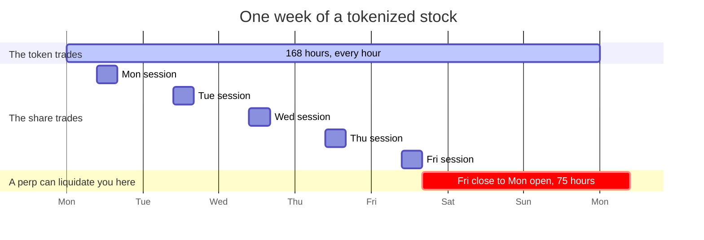
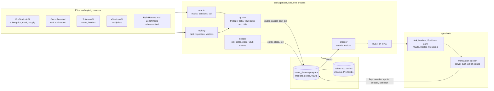
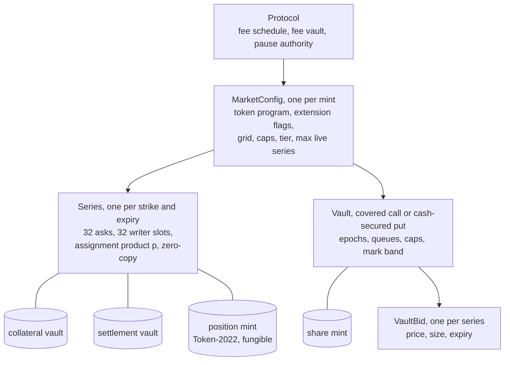
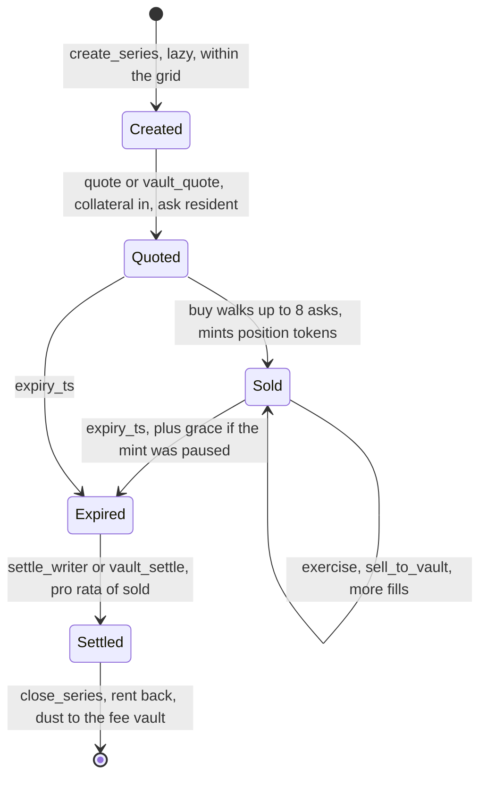
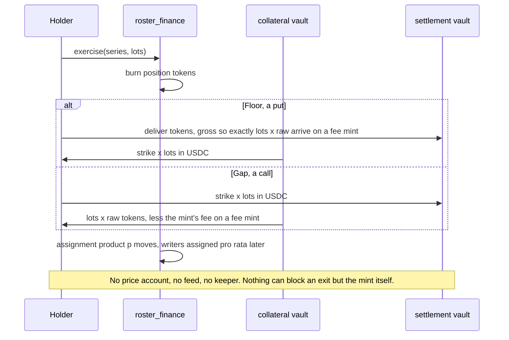
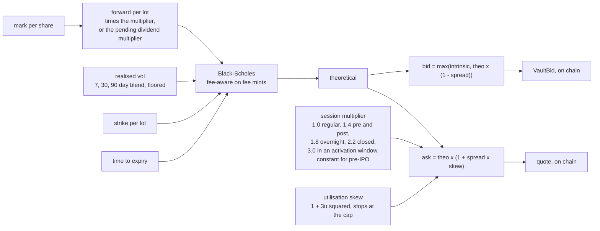
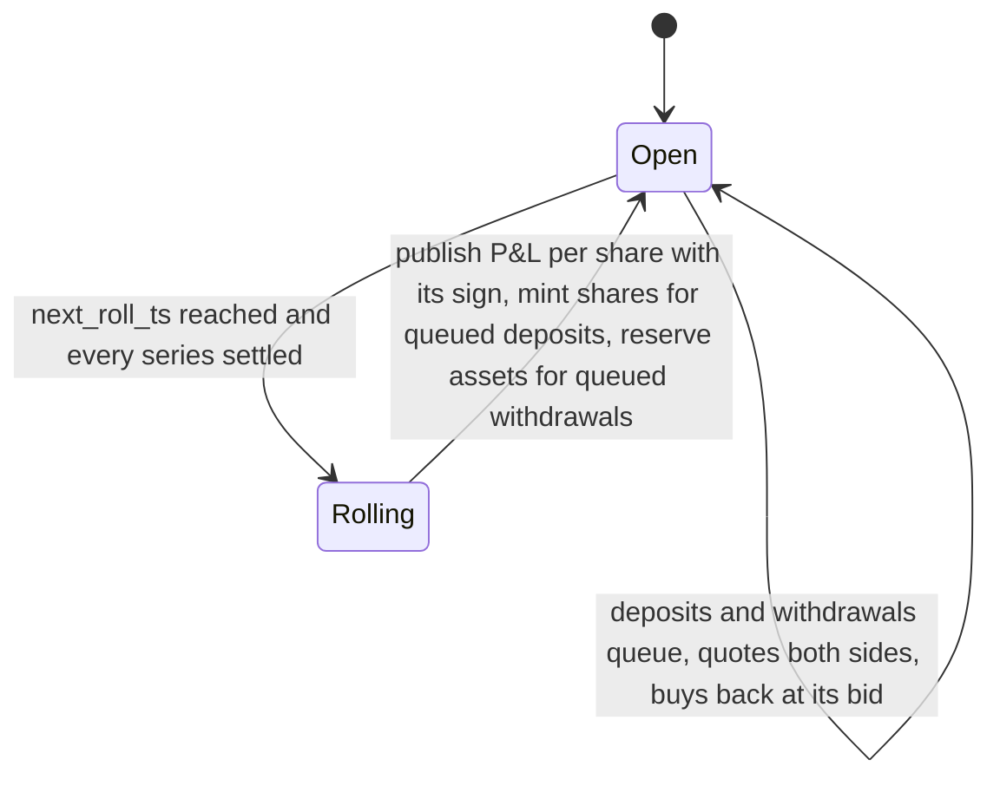
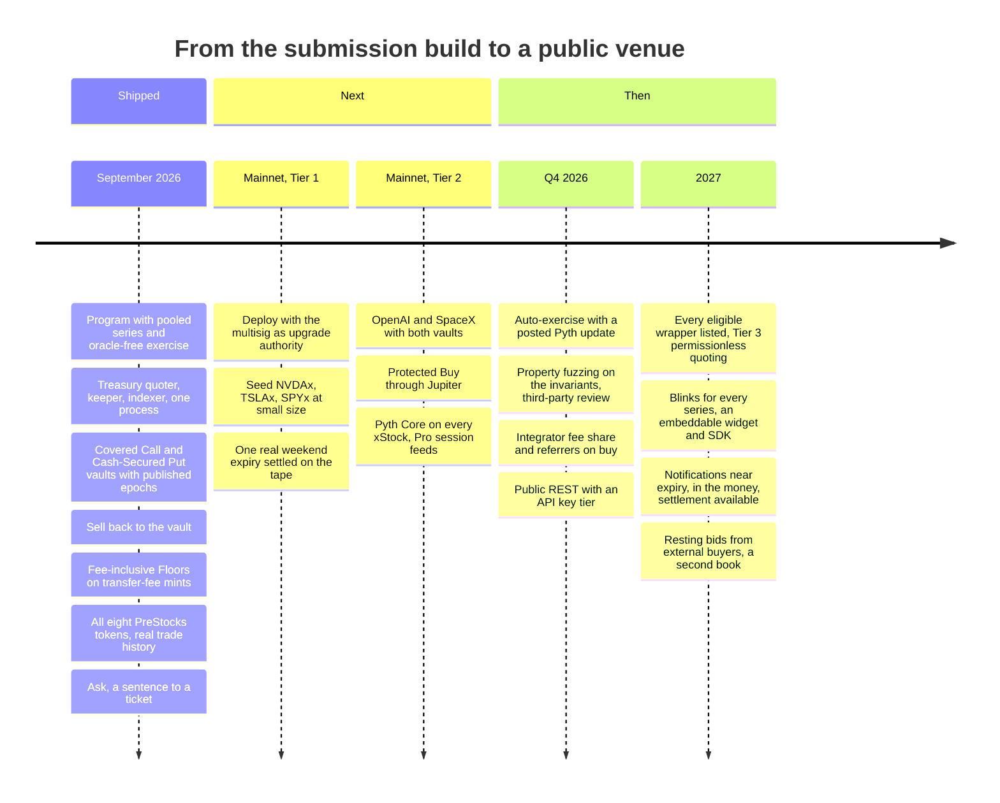

# Roster Finance

**Stock leverage without margin liquidation.**

Fully paid contracts on tokenized stocks and pre-IPO tokens, on Solana. Choose an expiry, see the premium and the break-even, and know your maximum loss before you click. No borrowing, no funding payments, no margin calls. Every contract is backed in full from the moment it is sold and settles into your wallet as the token itself.

Program [`FJUdsdmxAp3zAwZBg3ai34xzeCBDobnH1XDarvVa7uFV`](https://solscan.io/account/FJUdsdmxAp3zAwZBg3ai34xzeCBDobnH1XDarvVa7uFV?cluster=devnet) · `47` program tests · `17` fork tests on the real mints · `6` browser journeys · `14` markets, `8` of them pre-IPO

[Source](https://github.com/Adityaakr/roster-stock-options) · [Program](programs/roster_finance) · [Docs](docs) · [Architecture](docs/01-architecture.md) · [Pricing](docs/PRICING.md) · [Risk](#14-risk)

---

**Contents**

1. [The problem](#1-the-problem)
2. [The product](#2-the-product)
3. [Pre-IPO: the PreStocks desk](#3-pre-ipo-the-prestocks-desk)
4. [Architecture](#4-architecture)
5. [The protocol](#5-the-protocol)
6. [Pricing and the supply side](#6-pricing-and-the-supply-side)
7. [Where every number comes from](#7-where-every-number-comes-from)
8. [Try it in two minutes](#8-try-it-in-two-minutes)
9. [What is live, and how to check it](#9-what-is-live-and-how-to-check-it)
10. [Roadmap](#10-roadmap)
11. [Who has named this problem](#11-who-has-named-this-problem)
12. [Why this is the best answer yet](#12-why-this-is-the-best-answer-yet)
13. [Run it](#13-run-it)
14. [Risk](#14-risk)

---

## 1. The problem

Tokenized stocks trade `168` hours a week. The shares behind them trade `32.5`, about `19%` of the week. In the `75` hours between Friday's close and Monday's open the token book is thin, the share has no price, and a leveraged position can be liquidated on a move the market will never confirm. The only ways to lever a stock on Solana today are a perp or a loan loop, and both liquidate.

`63%` of tokenized-equity spot volume on Solana in 2026 happened outside US exchange hours (Decentralised.co, September 2026; the same figure in [Solana's own weekly](https://x.com/solana/status/2099113367999012968)). Perpetuals on tokenized equities did `$376.3B` against `$7.5B` of spot ([CoinGecko, September 2026](https://www.coingecko.com/en/api/reports/tokenized-equities-sep-2026)). The demand is for leverage. The instrument for it is the one that cannot liquidate you.



## 2. The product

| | Perps | Loops | Listed options | **Roster** |
| --- | --- | --- | --- | --- |
| Max loss | Unbounded, liquidation | Collateral liquidation | Premium | **Premium** |
| Funding or interest | Yes | Yes | No | **No** |
| Open on Saturday | Yes, synthetic mark | Yes | No | **Yes** |
| Settles into your wallet | No | No | No | **Yes, the token itself** |
| Can liquidate you | Yes | Yes | No | **No** |
| Coverage | A few names | A few names | US-listed only | **`14` markets, including pre-IPO** |

Underneath, these are fully collateralized, American-exercise, physically settled options. The word appears in the docs and the risk section; the product speaks in outcomes.

| Screen | What it does | For whom |
| --- | --- | --- |
| **Gap** | The upside with the loss capped. The right to buy at a strike through an expiry; if it never gets there, the premium is the whole loss. | A trader with a bullish view and a fixed risk budget |
| **Floor** | An exit at a known price on a known date. The right to sell at a strike any time through the expiry; the USDC is locked before you buy. | A holder through an earnings print or a weekend |
| **Earn** | Get paid to take the other side: lock USDC to be paid to buy lower, or lock tokens to be paid to sell higher. Paid risk, disclosed as such, never called yield. | Anyone with USDC or the token |
| **Vaults** | Deposit and let a vault write for you. A Covered Call vault sells Gaps above the mark; a Cash-Secured Put vault sells Floors below it. Every epoch's result is published with its sign. | Depositors who want the premium without the terminal |
| **Sell back** | Every vault posts a bid on what it has sold, so a winning position can be taken off without paying the strike. | Every holder |
| **Roster** | Every quote's collateral by account, every exercise by signature, every vault epoch, protocol-wide. | Anyone who wants to check rather than trust |
| **Ask** | Say what you want in a sentence and get the ticket; ask a question and get an answer from the live figures. The model parses, the app computes, every number is checked ([how](docs/INTENT.md)). | Someone who does not want to learn the instrument first |

## 3. Pre-IPO: the PreStocks desk

Eight [PreStocks](https://prestocks.com/products) tokens (OpenAI, SpaceX, Anthropic, Anduril, Neuralink, Kalshi, Polymarket, Figure AI) are listed as markets with both sides quoted. Nothing else on Solana gives a pre-IPO token holder a price fixed in advance, upside with the loss capped, or a premium for holding.

- **Priced off where the token trades, never the issuer's mark.** The spread between the two is shown as a premium or a discount; both exist today (OpenAI above its mark, SpaceX below), and neither is called a mispricing, because nothing converts one into the other before a listing.
- **Real trade history** from each token's most-traded USDC pool on [GeckoTerminal](https://www.geckoterminal.com): the chart over 24h, 7d, 30d or all, the day and week changes, liquidity, volume, and the volatility the quoter prices from.
- **The mint's transfer fee is in the price** and is the holder's on both sides: a Gap delivers the tokens less the fee; a Floor has the holder deliver gross so writers are paid every unit they are owed. Reconciled to the unit in the program's tests ([`fee_floor.rs`](programs/roster_finance/tests/fee_floor.rs)) and on the real OpenAI mint ([`p4-first-print.test.ts`](tests/e2e/p4-first-print.test.ts)).
- **The issuer's own terms on every ticket**, from the [PreStocks FAQ](https://prestocks.com/faq): on-chain exit at any time, the post-IPO conversion window after which tokens expire worthless, what happens in a deal, and the rights the token does not carry.

Why PreStocks, and what the desk adds that the token alone cannot: [`docs/03-prestocks-decision.md`](docs/03-prestocks-decision.md).

## 4. Architecture



Sources, each read as documented: the [PreStocks API](https://prestocks.com/api/prestocks), [GeckoTerminal](https://www.geckoterminal.com/dex-api) OHLCV, the [Tokens API](https://docs.tokens.xyz), the [xStocks multiplier API](https://docs.xstocks.fi/developers/multipliers) and [Assets API](https://docs.xstocks.fi/apis/openapi/assets), [Pyth Hermes](https://docs.pyth.network/price-feeds/core/how-pyth-works/hermes), [Benchmarks](https://docs.pyth.network/price-feeds/core/use-historical-price-data) and [market hours](https://docs.pyth.network/price-feeds/market-hours). Feed ids and the date each was resolved: [`docs/FEEDS.md`](docs/FEEDS.md). Every mint's extensions as read on chain: [`docs/MINT.md`](docs/MINT.md).

One process runs the four loops and serves the app; the app never scans the chain. A price reaches the book through a single service, so the quoter, the keeper, the indexer and the app all see the same mark. Transactions are built server-side from the same SDK the services use, signed in the wallet, and submitted through the app's own RPC, so the wallet's network setting never matters.

## 5. The protocol

The program lives in [`programs/roster_finance`](programs/roster_finance); the decisions behind it in [`docs/01-architecture.md`](docs/01-architecture.md) and [`docs/DECISIONS.md`](docs/DECISIONS.md); rent per series in [`docs/RENT.md`](docs/RENT.md) and compute per instruction in [`docs/COMPUTE.md`](docs/COMPUTE.md); the upgrade runbook in [`docs/UPGRADE.md`](docs/UPGRADE.md).

### Accounts



### A contract's life



Series are created lazily by the first writer to quote a term and capped per market (`max_live_series`), so a fourteen-market protocol cannot become the fragmentation problem that killed earlier venues. The ask list is a fixed-capacity array with price-time priority; a full list evicts its worst ask, whose collateral becomes withdrawable at once. `buy` walks at most `8` asks, never fills above the buyer's limit, and reports a partial fill plainly.

### Exercise reads no oracle



**Raw-unit denomination.** Every contract stores two integers: raw token units per lot and USDC per lot. A dividend reinvested through a scaled-UI multiplier, a split or a reverse split never touches a live contract; the multiplier is used to display share terms and to price, never to settle.

**Pooled assignment.** Writers are assigned pro rata of what they sold at expiry, not by who exercised first. Early exercises accumulate in the settlement vault; at expiry every writer receives the same blend of remaining collateral and settlement proceeds, exactly as listed options assign. There is no incentive to game timing.

**Positions are tokens.** Each series has a Token-2022 position mint with readable metadata. Positions show in any wallet and can be transferred or sold.

### Instructions

| Group | Instructions |
| --- | --- |
| Protocol | `init_protocol` `update_protocol` `withdraw_fees` |
| Markets | `create_market` `update_market` |
| Series and book | `create_series` `quote` `cancel_ask` `withdraw_unsold` `claim_premium` `buy` `exercise` `settle_writer` `close_series` `observe_halt` |
| Auto-exercise | `enable_auto_exercise` `disable_auto_exercise` `auto_exercise` |
| Vaults | `init_vault` `set_vault_params` `vault_deposit` `vault_request_withdraw` `vault_claim` `vault_roll` `vault_quote` `vault_cancel_ask` `vault_withdraw_unsold` `vault_claim_premium` `vault_settle` `vault_post_bid` `sell_to_vault` `vault_set_halt` |

Invariants held at every instruction boundary and property-tested with random instruction sequences ([`programs/roster_finance/tests`](programs/roster_finance/tests)): the collateral vault covers every unassigned contract; position supply equals sold less exercised; the sum of writers' sold equals the series' sold. Rounding always favours the vault; residual dust is swept to the fee vault at close, never to a user.

## 6. Pricing and the supply side

The model, its assumptions and the known mismatch between a token that trades all week and a share that trades a fifth of it: [`docs/PRICING.md`](docs/PRICING.md). The code: [`packages/quoter`](packages/quoter).



The treasury quotes every term it has capital for, and the vaults quote beside it through the same instruction as any writer. No writer is special-cased: a vault posts, cancels and gets evicted like anyone else. Breakers stop the quoter, never the book or an exercise: a stale price, a token-versus-share basis beyond `300` bps in the regular session, a paused or frozen mint, a halted vault.

### The vault's epoch



Deposits enter and withdrawals leave only at a roll, so nobody dilutes a week of carried risk and nobody runs on collateral behind live contracts. A losing epoch is published like any other.

## 7. Where every number comes from

| Figure | Source | Refresh |
| --- | --- | --- |
| xStock marks, 24h change, holders | [Tokens API](https://docs.tokens.xyz) market snapshots of the mainnet mint | every tick |
| xStock multipliers, activations | [xStocks API](https://docs.xstocks.fi/developers/multipliers) and the mint's scaled-UI extension | every tick; banner `15` minutes either side of an activation |
| PreStocks token price, mark, valuations, supply, logos | [PreStocks API](https://prestocks.com/api/prestocks) | every minute, last good answer kept |
| PreStocks trade history, liquidity, volume, changes | [GeckoTerminal](https://www.geckoterminal.com/dex-api) public OHLCV of the token's most-traded USDC pool on mainnet ([`geckoterminal.ts`](packages/registry/src/geckoterminal.ts)) | one token every `45` seconds, kept in the store |
| Pre-IPO volatility | 7, 30 and 90 day realised vol from the pool's daily closes | hourly |
| Pyth feeds | resolved and recorded in [`docs/FEEDS.md`](docs/FEEDS.md); read from [Hermes](https://docs.pyth.network/price-feeds/core/how-pyth-works/hermes) when the key's grant covers them | every tick |
| Every ask, reserve, position, exercise, epoch | the program's own accounts and events, through the indexer ([`packages/indexer`](packages/indexer)) | every `3` seconds |

Nothing on any screen is a placeholder. A figure the sources cannot provide is absent, never invented; each market page names which source priced its mark and which pool the chart reads.

## 8. Try it in two minutes

1. Open the app and connect a wallet, or use the built-in burner if you have no extension.
2. Click your address, then **Get test funds**: `25` of every token, `25,000` USDC and SOL to sign with.
3. **Ask** → type "protect my 20 NVDAx through earnings" → **Review and buy** → sign. That is a fully paid contract in your wallet.
4. **Positions** → **Sell** at the vault's bid, or **Exercise**. Sign.
5. **PreStocks** → OPENAI → buy a Floor. Exercise it and watch the fee delivered on top.
6. **Vaults** → deposit `1` NVDAx. It enters at the next roll, at that roll's published price.

Every step is a real transaction on the Solana cluster the header names, with a signature you can open on [Solscan](https://solscan.io/?cluster=devnet).

## 9. What is live, and how to check it

| Claim | Where | Verify |
| --- | --- | --- |
| The program: pooled series, bounded ask book, pooled assignment, oracle-free exercise, the halt rule, two vaults, `sell_to_vault`, fee-inclusive Floors | [`programs/roster_finance`](programs/roster_finance) | `cargo test --release -p roster_finance`: `47` tests, including a covered-call vault on a fee mint settling to zero locked and rolling, and a Floor with three prime-sized writers reconciled to the unit |
| Fourteen markets listed and escrow-proven, all eight PreStocks tokens among them | [`fixtures/registry/registry.devnet.json`](fixtures/registry/registry.devnet.json) | each entry's `escrowProof` is two signatures: a lot into the series vault and back |
| Six vaults quoting, four of them on PreStocks tokens | `/vaults` in the app, `GET /v1/vaults` | epoch records with P&L per share, signed |
| The whole journey in a browser with no terminal: funds, buy a Gap, buy a Floor, write, exercise, receipt | [`apps/web/e2e/devnet.spec.ts`](apps/web/e2e/devnet.spec.ts) | `pnpm --filter @roster/web exec playwright test --project=devnet` |
| The supply side in a browser: deposit, buy from the vault, sell back to it | [`apps/web/e2e/vault.spec.ts`](apps/web/e2e/vault.spec.ts) | same command |
| PreStocks in a browser: the desk, OPENAI, buy a Floor, exercise with the fee delivered on top | [`apps/web/e2e/prestocks-devnet.spec.ts`](apps/web/e2e/prestocks-devnet.spec.ts) | same command |
| Ask: a sentence becomes a ticket, and a question gets an answer from the live figures | [`apps/web/e2e/intent-devnet.spec.ts`](apps/web/e2e/intent-devnet.spec.ts), [`docs/INTENT.md`](docs/INTENT.md) | same command |
| The same lifecycle on the real NVDAx and OpenAI mints, with expiry, settlement and release by time travel | [`tests/e2e`](tests/e2e) on a mainnet fork ([Surfpool](https://docs.surfpool.run)) | `pnpm fork` then `pnpm test:fork`: `17` tests |
| Real marks with no Pyth subscription; real trade history for every PreStocks token | [`packages/services`](packages/services), [`geckoterminal.ts`](packages/registry/src/geckoterminal.ts) | every market page names which source priced it and which pool the chart reads |

**Deployment.** The program above is deployed and upgradeable on Solana's public test cluster; the app's header names the cluster on every screen, and each market trades a replica of its mainnet mint with the same Token-2022 extensions, priced from the mainnet token. How the cluster is set up: [`docs/DEVNET.md`](docs/DEVNET.md). Mainnet is a documented stop-and-ask step ([`docs/DEPLOY.md`](docs/DEPLOY.md), [`docs/SEEDING.md`](docs/SEEDING.md)): the code path is identical; the difference is program rent and seed capital.

Every mint's eligibility verdict, from the extension read to the escrow proof: [`docs/ELIGIBILITY.md`](docs/ELIGIBILITY.md).

**Not live.** Protected Buy needs a swap route, which a replica does not have; it round-trips on the fork and is marked as such in the app. Auto-exercise needs a verifiable on-chain price and no free Pyth read exists; contracts are American, so holders exercise themselves and the app says so.

## 10. Roadmap

The milestone queue that produced the shipped column, with the check that proved each slice: [`docs/02-roadmap.md`](docs/02-roadmap.md). What follows it:



### What comes next, and why in that order

| Milestone | Why it is next | Done when |
| --- | --- | --- |
| **Mainnet, Tier 1 at small size** | The only open question is whether people will use it, and a real expiry answers it. The code path is the one already tested on the fork against the real mints; what changes is rent and seed capital, both budgeted in [`docs/DEPLOY.md`](docs/DEPLOY.md) and [`docs/SEEDING.md`](docs/SEEDING.md). | One weekend expiry settled with signatures on the tape; one outsider has bought a contract |
| **Pyth Core and Pro** | Prices every xStock from the token feed, the equity reference and the session feeds, so the basis breaker and the session-aware spread run on published data rather than the model's own. | `volSource` reads `benchmarks` on every xStock; `.PRE`, `.POST` and `.ON` sessions drive the spread |
| **Auto-exercise with a posted update** | A holder who forgets should still be paid. The crank posts a [Pyth](https://docs.pyth.network/price-feeds/core/how-pyth-works/hermes) update in the same transaction so the decision is verifiable on chain; exercise itself stays oracle-free. | Absent holders are exercised in the grace window; an out-of-the-money crank declines with a signature |
| **Protected Buy on mainnet** | A [Jupiter](https://jup.ag) swap and a Floor in one transaction is the product for a holder who has not bought yet. | One round trip on mainnet with the Floor sized to the swap's minimum out |
| **Review, fuzzing, bounty** | Before Tier 1 caps are raised beyond the seed. | Report linked from the docs; property tests and fuzzing green in CI |
| **Integrators** | Wallets and desks that embed the ticket earn a share of the taker fee. | A second front end completes a buy with a referrer that receives its share |
| **Every wrapper, Tier 3** | The registry already inspects and grades every xStock, Ondo and PreStocks mint; listing becomes a rule, not a decision. | Any eligible mint can be quoted by anyone; depth shown as zero until it is not |
| **Resting bids** | The last asymmetry: today only vaults bid. A second book lets any holder leave at a price they set. | A resting bid fills a seller who is not a vault |

The order is deliberate. Capital goes to mainnet before features because a settled expiry is the only proof that matters; feeds and the crank come before expansion because they make the existing markets safer; expansion comes last because the live-series cap and the tier rule already make it cheap.

## 11. Who has named this problem

Cited by publisher and month, linked where the piece is public; none of these is our claim.

- **[CoinGecko, September 2026](https://www.coingecko.com/en/api/reports/tokenized-equities-sep-2026).** Perpetuals on tokenized equities did `$376.3B` against `$7.5B` of spot. The demand is for leverage; the instrument for it is the one that cannot liquidate you.
- **Decentralised.co, September 2026.** `63%` of tokenized-equity spot volume on Solana in 2026 happened outside US exchange hours: the token trades when the share does not. Their case for concentrating options liquidity on one asset concerned SOL; applying it to a stock is our reading. The after-hours share is also in [Solana's own weekly](https://x.com/solana/status/2099113367999012968).
- **[Pyth, February 2026](https://www.pyth.network/blog/overnight-equities-explained).** Synthetic overnight pricing produced liquidations at untradeable prices. A mark the market never printed is still a mark a perp will liquidate on.
- **[Pantera, June 2026](https://panteracapital.com/article/tokenized-startups-restoring-access-to-pre-ipo-companies/).** Equity-based tokenized startups were out-trading perps. The demand for the underlying is there; the instruments around it are not.
- **[The Block, May 2026](https://www.theblock.co/newsletters/the-funding/2026-05-17-spacex-ipo-pre-ipo-perps-crypto-401570).** A `$200M` pre-IPO position hedged against `$3M` of open interest. The exit market for private-company tokens is a rounding error next to the positions that need one.
- **[PreStocks, their own FAQ](https://prestocks.com/faq).** A holder can exit through on-chain liquidity, and after an IPO the token converts within a window or expires worthless. That is an exit whose price nobody knows in advance, on an asset with a hard deadline.
- **[Alpaca, on order types](https://docs.alpaca.markets/docs/orders-at-alpaca).** A limit order controls the price of a fill but not whether it fills. Through the hours a holder most needs to leave, it can sit there.

Everyone above is describing the same gap from a different side: an asset that trades all week, a reference price that exists for a fifth of it, leverage that liquidates on the difference, and no way to fix a price for a date.

## 12. Why this is the best answer yet

Each earlier answer solved one part and left the rest.

| Approach | What it gets right | What it leaves | Roster |
| --- | --- | --- | --- |
| Perps (Hyperliquid, CEX stock perps) | Leverage, always open | Liquidation on a synthetic mark, funding every hour | Loss capped at the premium; no mark can liquidate; the token itself is delivered |
| Loops (Kamino, Loopscale) | Spot exposure with borrow | Collateral liquidation, interest, no fixed exit | No borrowing; nothing to liquidate |
| Order-book options (PsyOptions, Zeta v1) | Fully collateralized, physically settled, price discovery | Empty books; every strike its own thin market; shut down or pivoted | The same book, plus a vault that always quotes into it, and a live-series cap so the book cannot sprawl |
| Pool options (Hegic) | A counterparty on day one | One implied volatility whatever the flow: sold cheap into every spike | The vault's ask rises with its own utilisation and stops at the cap; external makers can undercut it, so the book still discovers price |
| Hedged pools (Lyra, Premia) | Capital efficiency | Need a perp to hedge on; there is no single-name stock perp on Solana | Only the two structurally safe writer positions, covered call and cash-secured put, so an unhedged writer's worst case is owning or having sold the stock at a strike they chose |
| Vaults (Ribbon, Friktion, Katana) | Depositors accept "hold this, get paid" | Drawdowns hidden until they hit; one strike, one expiry, no bid | Weekly epochs with every result published with its sign; a bid on everything the vault has sold, so holders can leave without paying the strike |
| Listed options (CBOE) | The instrument itself | Closed on Saturday; not on chain; not on pre-IPO names | Open all week; settles into the wallet; the same contract on OpenAI and SpaceX tokens |

Four decisions carry it.

1. **Exercise reads no oracle.** A holder burns, pays or delivers, and receives from a vault that was funded before the contract was sold. The hours when a feed is stale or absent are exactly the hours a holder needs to leave, so a feed was never allowed near the exit. Pyth prices the contract; it never gates it.
2. **Raw-unit denomination.** Contracts are integers of raw tokens and USDC per unit, so dividends, splits and multiplier changes never touch a live position.
3. **The book and the vault together.** The book alone died of empty strikes; the pool alone died of one price. Here the vault guarantees a counterparty on day one and prices its own risk by utilisation, and any maker who thinks it is wrong can undercut it in the same book.
4. **Published risk.** Every quote's collateral by account, every exercise by signature, every vault epoch with its sign, on the roster page from day one. The claim is not "trust the vault"; it is "check it".

What it still carries from its predecessors: the vaults are short volatility with no hedge available, and they will have losing epochs. Every one is published, the deposit screen shows three adverse scenarios in real numbers, and nothing on the product is called yield.

## 13. Run it

```
cp .env.example .env                       # docs/OPERATOR.md names every variable
pnpm install
pnpm anchor:build && pnpm anchor:deploy     # the program
pnpm devnet:mints && pnpm devnet:registry  # replica mints and the registry (once)
pnpm list-markets --devnet && pnpm devnet:seed && pnpm devnet:vaults --roll-now --align
pnpm services                              # quoter, keeper, indexer, REST on :8787
pnpm dev                                   # the app on http://localhost:3000
```

Every variable, where to get it and what it unlocks: [`docs/OPERATOR.md`](docs/OPERATOR.md). For the mainnet fork ([Surfpool](https://docs.surfpool.run)): `pnpm fork`, `pnpm anchor:deploy`, `pnpm registry && pnpm list-markets && pnpm seed`, then the same two.

```
programs/roster_finance   Anchor program: series, book, exercise, settlement, vaults
packages/core             units, multiplier, session clock, bounded fan-out
packages/sdk              TypeScript client for every instruction and account
packages/oracle           marks, realised volatility, the xStocks multiplier watcher
packages/indexer          store fed by program events
packages/quoter           the pricing model (docs/PRICING.md), the treasury's leg and the vault's leg
packages/keeper           grid roll, halt observation, settle, close, the vault's cranks
packages/registry         xStocks, Ondo, PreStocks, Tokens API, GeckoTerminal; mint inspection and verdicts
packages/services         one process: the loops and the REST the app reads
apps/web                  the app: ask, markets, terms, positions, earn, vaults, roster, prestocks
docs/                     architecture, decisions, pricing, intent, deploy, operator, feeds, mints
```

### Docs

| Read | For |
| --- | --- |
| [`01-architecture.md`](docs/01-architecture.md) | The load-bearing decisions and the evidence behind each |
| [`02-roadmap.md`](docs/02-roadmap.md) | The milestone queue that built this, with each proof |
| [`03-prestocks-decision.md`](docs/03-prestocks-decision.md) | Why the pre-IPO desk is PreStocks, and what it adds |
| [`DECISIONS.md`](docs/DECISIONS.md) | Every deviation from the brief, dated |
| [`PRICING.md`](docs/PRICING.md) | The model the treasury and the vaults quote from |
| [`INTENT.md`](docs/INTENT.md) | Where a language model is allowed in a venue that promises nothing can be mispriced by it |
| [`ELIGIBILITY.md`](docs/ELIGIBILITY.md) | Every mint's verdict and escrow proof |
| [`MINT.md`](docs/MINT.md) | Every mint's extensions as read on chain |
| [`FEEDS.md`](docs/FEEDS.md) | Pyth feed ids with source and date |
| [`RENT.md`](docs/RENT.md), [`COMPUTE.md`](docs/COMPUTE.md) | Measured rent per series and compute per instruction |
| [`DEVNET.md`](docs/DEVNET.md), [`DEPLOY.md`](docs/DEPLOY.md), [`SEEDING.md`](docs/SEEDING.md), [`UPGRADE.md`](docs/UPGRADE.md) | Cluster setup, hosting, the mainnet funding proposal, the upgrade runbook |
| [`OPERATOR.md`](docs/OPERATOR.md) | External inputs and which step each one unlocks |
| [`BUILD_LOG.md`](docs/BUILD_LOG.md) | What was built and verified, phase by phase |

## 14. Risk

Fully collateralized, American exercise, physical settlement. A contract does not protect against chain halts, token freezes, pauses or transfer restrictions on the underlying mint. Dividend reinvestment during a Gap accrues to the escrowed tokens and is captured by the buyer at exercise. xStocks are tracker certificates with no voting rights. PreStocks tokens confer no ownership, voting, dividend or information rights, and after an IPO must be converted within the issuer's window or expire worthless. Non-US wrappers; counsel before expanding.

Contracts can expire worthless. Maximum loss on a purchase is the premium plus fees. Writing is paid risk. Nothing here is an offer of any security. The program is unaudited.
